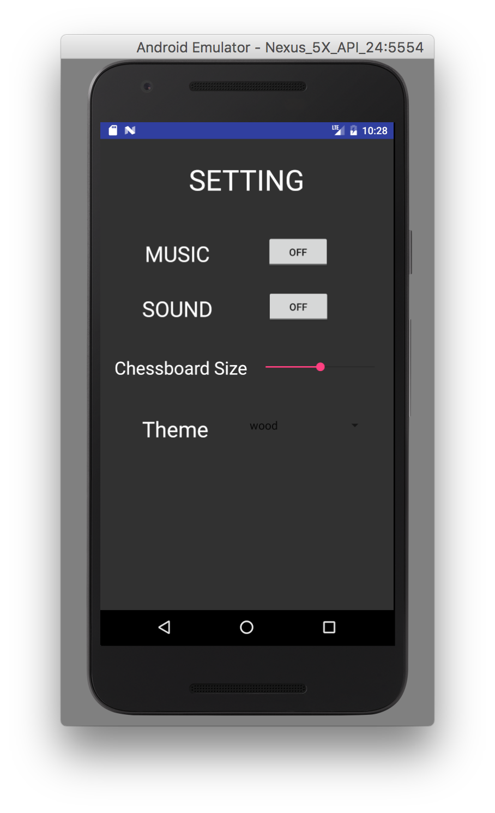

# Group16 ChessGame - Five In A Row

##Introduction
This is a game called **Five-In-A-Row**.

Two players take turns to put a chess on the chessboard.

The player who first makes five chess in a line wins the game.

Hope you enjoy it! :)

##Main Functions
Single Player Mode - Play with AI

Multi Player Mode - Play with a friend on one device

Background Music

Settings

##Expected Functions
Online Mode - Play with another player online

##Screen Shoots
###Main Activity

###Game

###Setting

##References
laserwave's project - reversi chess: [https://github.com/laserwave/Reversi](https://github.com/laserwave/Reversi)
